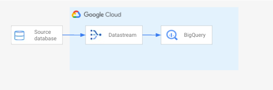

# Datastream - MySQL to BigQuery (preview)



Datastream is a serverless and easy-to-use Change Data Capture (CDC) and replication service that allows you to synchronize data across heterogeneous databases, storage systems, and applications reliably and with minimal latency. In this lab you’ll learn how to replicate data changes from your OLTP workloads into BigQuery, in real time. 

In this hands-on lab you’ll deploy the below mentioned resources all at once via terrafrom or individually. Then, you will create and start a Datastream stream for replication and CDC.

What you’ll do:

- Prepare a MySQL Cloud SQL instance
- Create a Cloud Storage bucket
- Import data into the Cloud SQL instance
- Create a Datastream connection profile referencing MySQL DB as source profile
- Create a Datastream connection profile referencing BigQuery as destination profile
- Create a Datastream stream and start replication
- Write Inserts and Updates
- Verify updates in BigQuery


## Git clone repo 

```
git clone https://github.com/AmritRaj23/data-journey-v2.git
cd data-journey-v2/CDC
```

## Set-up Cloud Environment

### Initilize your account and project

If you are using the Google Cloud Shell you can skip this step.

```
gcloud init
```
### Set Google Cloud Project

```
export project_id=<your-project-id>
gcloud config set project $project_id
```

### Check Google Cloud Project config set correctly

```
gcloud config list
````

### Set compute zone

```
gcloud config set compute/zone us-central1-f
```
## Deploy using Terraform

Use Terraform to deploy the folllowing services and netwroking resources defined in the `main.tf` file

- Cloud SQL
- Cloud Storage

### Install Terraform

If you are using the Google Cloud Shell Terraform is already installed.

Follow the instructions to [install the Terraform cli](https://learn.hashicorp.com/tutorials/terraform/install-cli?in=terraform/gcp-get-started).

This repo has been tested on Terraform version `1.2.6` and the Google provider version  `4.31.0`

### Update Project ID in terraform.tfvars

Rename the `terraform.tfvars.example` file to `terraform.tfvars` and update the default project ID in the file to match your project ID.

Check that the file has been saved with the updated project ID value

```
cat terraform.tfvars
```

### Initialize Terraform

```
terraform init
```

### Create resources in Google Cloud

Run the plan cmd to see what resources will be greated in your project.

**Important: Make sure you have updated the Project ID in terraform.tfvars before running this**

```
terraform plan
```

Run the apply cmd and point to your `.tfvars` file to deploy all the resources in your project.

```
terraform apply -var-file terraform.tfvars
```

This will show you a plan of everything that will be created and then the following notification where you should enter `yes` to proceed:

```
Plan: 5 to add, 0 to change, 0 to destroy.

Do you want to perform these actions?
  Terraform will perform the actions described above.
  Only 'yes' will be accepted to approve.

  Enter a value: 
```

### Terraform output

Once everything has succesfully run you should see the following output:

```
google_compute_network.vpc_network: Creating...
.
.
.
Apply complete! Resources: 5 added, 0 changed, 0 destroyed.
```

## Import a SQL file into MySQL

Open a file named create_mysql.sql in vim or your favorite editor, then copy the text below into your file:

```
CREATE DATABASE IF NOT EXISTS database_datajourney;
USE database_datajourney;

CREATE TABLE IF NOT EXISTS database_datajourney.example_table (
event_timestamp timestamp,
event_name varchar(255),
user_pseudo_id varchar(255)
);

INSERT INTO database_datajourney.example_table (event_timestamp, event_name, user_pseudo_id) VALUES
(153861, 'level_complete_quickplay', 'D50D60807F5347EB64EF0CD5A3D4C4CD'),
(153862,'screen_view', 'D50D60807F5347EB64EF0CD5A3D4C4CD'),
(153863, 'post_score', '2D50D60807F5347EB64EF0CD5A3D4C4CD');
```

Next, you will copy this file into the Cloud Storage bucket you created above, make the file accessible to your Cloud SQL service account, and import the SQL command into your database.

```
SERVICE_ACCOUNT=$(gcloud sql instances describe mysql | grep serviceAccountEmailAddress | awk '{print $2;}')

gsutil cp create_mysql.sql gs://${project_id}/resources/create_mysql.sql
gsutil iam ch serviceAccount:${SERVICE_ACCOUNT}:objectViewer gs://${project_id}

gcloud sql import sql mysql gs://${project_id}/resources/create_mysql.sql --quiet
```

## Create Datastream resources

In the Cloud Console UO, navigate to Datastream then click Enable to enable the Datastream AP.

Create two connection profiles, one for the MySQL source, and another for the BigQuery destination.

My SQL connection profile:
- The IP and port of the Cloud SQL for MySQL instance created earlier
- username: `root`, password: `password123`
- encryption: none
- connectivity method: IP allowlisting
BigQuery connection profile:
- connection profile ID

Create stream by selecting MyQL and BigQuery connection profiles, and make sure to mark the tables you want to replicate (we will only replicate the datastream-datajourney database), and finally run validation, and create and start the stream.

## View the data in BigQuery

View these tables in the BigQuery UI.

## Write Inserts and Updates

Open a file named update_mysql.sql in vim or your editor, then copy the text below into your file:

```
CREATE DATABASE IF NOT EXISTS database_datajourney;
USE database_datajourney;

CREATE TABLE IF NOT EXISTS database_datajourney.example_table (
event_timestamp timestamp,
event_name varchar(255),
user_pseudo_id varchar(255)
);

INSERT INTO database_datajourney.example_table (event_timestamp, event_name, user_pseudo_id) VALUES
(153864, 'level_complete_quickplay', 'D50D60807F5347EB64EF0CD5A3D4C4CD'),
(153865, 'level_start_quickplay', 'D50D60807F5347EB64EF0CD5A3D4C4CD'),
(153866, 'level_fail_quickplay', 'D50D60807F5347EB64EF0CD5A3D4C4CD'),
(153867, 'session_start', 'D50D60807F5347EB64EF0CD5A3D4C4CD'),
(153868, 'user_engagement', 'D50D60807F5347EB64EF0CD5A3D4C4CD');
```

Next, you will copy this file into the Cloud Storage bucket you created above, make the file accessible to your Cloud SQL service account, and import the SQL command into your database.

```
SQL_FILE=update_mysql.sql
SERVICE_ACCOUNT=$(gcloud sql  describe mysql | grep serviceAccountEmailAddress | awk '{print $2;}')

gsutil cp ${SQL_FILE} gs://${project_id}/resources/${SQL_FILE}
gsutil iam ch serviceAccount:${SERVICE_ACCOUNT}:objectViewer gs://${project_id}

gcloud sql import sql mysql gs://${project_id}/resources/${SQL_FILE} --quiet
```

## Verify updates in BigQuery

Run the query below to verify data changes in BiqQuery:

```
SELECT
 *
FROM
 `<project_id>.database_datajourney.example_table`
LIMIT
 100
```

## Terraform Destroy

Use Terraform to destroy all resources

```
terraform destroy
```
