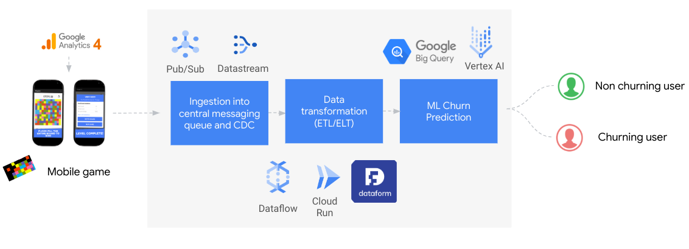

# Welcome to Cloud Native Data Journey with Google Cloud!

In this repository you will fins seried of demos and labs how to build end-to-end data pipeline, from collection, over transformation and up to activation of the data.

We will be using raw event data from a real mobile gaming app called Flood It, that originates from Google Analytics for Firebase.

Events provide insight on what is happening in an app or on a website, such as user actions, system events, or errors. 

Every row in the dataset is an event, with various characteristics relevant to that event stored in a nested format within the row. 

While Google Analytics logs many types of events already by default, developers can also customize the types of events they also wish to log.

User retention can be a major challenge for mobile game developers.

The goal of this workshop is to develop an ML propensity model to determine the likelihood of users returning to your app.

By the end of this workshop, you will learn how to:

- Stream the raw event data into messaging queue (/Data-Simulator)
- Transform the data using different tranformation tools (/ETL)
- Tranform the data once it is loaded into BigQuery (/ELT)
- Synchronize the data in MySQL adn BigQuery (/CDC)
- Train ML model Using BigQueryML and automate your ML workflow using Vertex ML Pipelines (/ML)  

# Good luck and have fun! 

